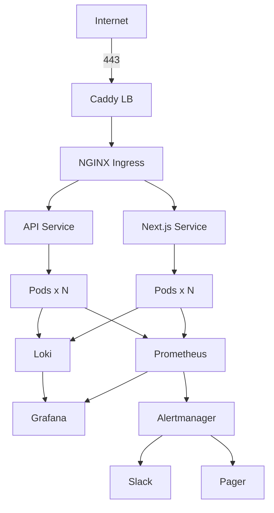

# k8s-ops-toolkit

[](https://opensource.org/licenses/MIT)
[](https://kubernetes.io)
[](https://helm.sh)
[](https://prometheus.io)
[](https://grafana.com)
[](https://grafana.com/oss/loki/)
[](https://github.com/sarmakska/k8s-ops-toolkit)

**Production-grade Helm bundles and observability for Next.js apps on Kubernetes.**

Built by [Sarma Linux](https://sarmalinux.com).

---

## What this is

Most teams reach for Kubernetes when they outgrow Vercel or want to cut costs. Then they spend two weeks configuring the same things everyone else configures: ingress, cert-manager, monitoring, logging, autoscaling, secrets.

This toolkit is those things, ready to go. Drop your Next.js app into the chart, set the domain, install. Includes a full observability stack (Prometheus + Grafana + Loki + Alertmanager) preconfigured for the common Next.js failure modes.

## Architecture



## What is in the box

- `charts/nextjs-app` — Helm chart for any Next.js app (probes, autoscaling, ingress, ConfigMap, Secret, ServiceMonitor)
- `charts/observability` — Prometheus + Grafana + Loki + Alertmanager + 8 preconfigured dashboards
- `manifests/cert-manager` — Let's Encrypt issuers for staging and production
- `manifests/ingress-nginx` — NGINX ingress with sensible defaults
- `scripts/install.sh` — one-shot install of everything on a fresh cluster
- `scripts/upgrade.sh` — Helm upgrades with rollback safety
- `scripts/disaster-recovery.sh` — backup + restore Velero workflows

## Quick start

```bash
git clone https://github.com/sarmakska/k8s-ops-toolkit.git
cd k8s-ops-toolkit
export KUBECONFIG=~/.kube/your-cluster.yaml
./scripts/install.sh \
  --domain example.com \
  --email you@example.com \
  --slack-webhook https://hooks.slack.com/...
```

In about 8 minutes you have ingress, TLS, monitoring, logging, and alerting working.

## Deploy a Next.js app

```bash
helm install my-app ./charts/nextjs-app \
  --set image.repository=ghcr.io/you/my-app \
  --set image.tag=v1.0.0 \
  --set ingress.host=app.example.com \
  --set replicas=3
```

## Roadmap

- [x] Next.js Helm chart with probes, autoscaling, ingress
- [x] Observability stack (Prom + Grafana + Loki + Alertmanager)
- [x] cert-manager + ingress-nginx manifests
- [x] Disaster recovery scripts via Velero
- [ ] Postgres operator integration (CrunchyData or Zalando)
- [ ] Redis operator
- [ ] Cilium-based eBPF observability layer
- [ ] Karpenter autoscaling templates for AWS
- [ ] ArgoCD app-of-apps pattern

## License

MIT.

Built by [Sarma Linux](https://sarmalinux.com).


---

## More open source by Sarma

Part of a portfolio of twelve production-shaped open-source repositories built and maintained by [Sarma](https://sarmalinux.com).

| Repository | What it is |
|---|---|
| [Sarmalink-ai](https://github.com/sarmakska/Sarmalink-ai) | Multi-provider OpenAI-compatible AI gateway with 14-engine failover and intent-based plugin auto-routing |
| [agent-orchestrator](https://github.com/sarmakska/agent-orchestrator) | Durable multi-agent workflows in TypeScript with deterministic replay and Inspector UI |
| [voice-agent-starter](https://github.com/sarmakska/voice-agent-starter) | Sub-second full-duplex voice agent loop. WebRTC, mediasoup, pluggable STT / LLM / TTS |
| [ai-eval-runner](https://github.com/sarmakska/ai-eval-runner) | Evals as code. Python, DuckDB, FastAPI viewer, regression mode for CI |
| [mcp-server-toolkit](https://github.com/sarmakska/mcp-server-toolkit) | Production Model Context Protocol server starter (Python / FastAPI) |
| [local-llm-router](https://github.com/sarmakska/local-llm-router) | OpenAI-compatible proxy that routes to Ollama or cloud providers based on policy |
| [rag-over-pdf](https://github.com/sarmakska/rag-over-pdf) | Minimal end-to-end RAG starter for PDF corpora |
| [receipt-scanner](https://github.com/sarmakska/receipt-scanner) | Vision OCR for receipts with Zod-validated JSON output |
| [webhook-to-email](https://github.com/sarmakska/webhook-to-email) | Webhook receiver that forwards events to email via Resend |
| [k8s-ops-toolkit](https://github.com/sarmakska/k8s-ops-toolkit) | Helm chart for shipping Next.js to Kubernetes with full observability stack |
| [terraform-stack](https://github.com/sarmakska/terraform-stack) | Vercel + Supabase + Cloudflare + DigitalOcean modules in one Terraform repo |
| [staff-portal](https://github.com/sarmakska/staff-portal) | Open-source HR / ops portal — leave, attendance, expenses, kiosk mode |

Engineering essays at [sarmalinux.com/blog](https://sarmalinux.com/blog) &middot; All projects at [sarmalinux.com/open-source](https://sarmalinux.com/open-source)
