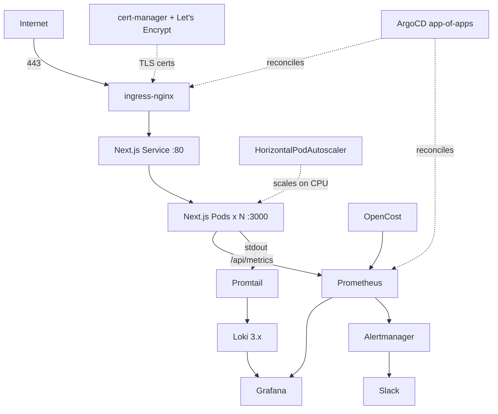

# k8s-ops-toolkit

[](https://github.com/sarmakska/k8s-ops-toolkit/actions/workflows/ci.yml)
[](https://opensource.org/licenses/MIT)
[](https://github.com/sarmakska/k8s-ops-toolkit/commits/main)
[](https://github.com/sarmakska/k8s-ops-toolkit)
[](charts/nextjs-app/Chart.yaml)
[](https://kubernetes.io)
[](https://helm.sh)
[](https://prometheus.io)
[](https://grafana.com)
[](https://grafana.com/oss/loki/)
[](https://www.opencost.io)
[](https://argo-cd.readthedocs.io)
[](https://github.com/sarmakska/k8s-ops-toolkit)

**Production-grade Helm bundles and observability for Next.js apps on Kubernetes.**

Built by [Sarma Linux](https://sarmalinux.com).

---

## What this is

Most teams reach for Kubernetes when they outgrow Vercel or want to cut costs. Then they spend two weeks configuring the same things everyone else configures: ingress, cert-manager, monitoring, logging, autoscaling, secrets.

This toolkit is those things, ready to go. Drop your Next.js app into the chart, set the domain, install. It includes a full observability stack (Prometheus, Grafana, Loki 3.x, Alertmanager) preconfigured for the common Next.js failure modes, an OpenCost spend dashboard, and a GitOps path through ArgoCD when you want the platform reconciled from git rather than installed by hand.

## Architecture


```mermaid
graph TD
  Internet[Internet] -->|443| Ing[ingress-nginx]
  Cert[cert-manager + Let's Encrypt] -.TLS certs.-> Ing
  Ing --> Svc[Next.js Service :80]
  Svc --> Pods[Next.js Pods x N :3000]
  HPA[HorizontalPodAutoscaler] -.scales on CPU.-> Pods
  Pods -->|/api/metrics| Prom[Prometheus]
  Pods -->|stdout| Promtail[Promtail] --> Loki[Loki 3.x]
  OpenCost[OpenCost] --> Prom
  Prom --> Graf[Grafana]
  Loki --> Graf
  Prom --> AM[Alertmanager]
  AM --> Slack[Slack]
  Argo[ArgoCD app-of-apps] -.reconciles.-> Ing
  Argo -.reconciles.-> Prom
```

## What is in the box

- `charts/nextjs-app`: Helm chart for any Next.js app. Deployment with a tuned rolling update strategy and hardened security context, zone-aware topology spread so a single zone or node failure cannot take the whole app down, optional nodeSelector, affinity and tolerations, a configurable graceful-shutdown window, ClusterIP service, ingress with cert-manager TLS, HorizontalPodAutoscaler, PodDisruptionBudget, liveness and readiness probes, inline and secret-backed environment injection, and a Prometheus ServiceMonitor.
- `scripts/install.sh`: one-shot, version-pinned install of the surrounding platform on a fresh cluster. ingress-nginx, cert-manager with a Let's Encrypt production issuer, kube-prometheus-stack (Prometheus, Grafana, Alertmanager), Loki 3.x with Promtail for logs, and OpenCost for spend, with an optional Slack webhook for alerting.
- `scripts/load-dashboards.sh`: loads the bundled Grafana dashboards into the cluster as sidecar ConfigMaps.
- `manifests/`: the bundled Grafana dashboards (Next.js app, OpenCost spend), Prometheus alert rules, and the Alertmanager and Loki values files.
- `gitops/argocd/`: an app-of-apps that reconciles the same pinned platform from git through ArgoCD, the alternative to the imperative installer.

## When to use this, and when not to

Use this if you are moving a Next.js app off a managed platform onto your own Kubernetes cluster and you do not want to hand-write deployment, ingress, TLS, autoscaling, and monitoring manifests. It is a good fit for a platform team standardising several internal Next.js services on one consistent shape, and for cost-controlled staging environments that need real certificates and metrics without much spend.

Do not use this if you are happy on Vercel or another managed platform, because you would be taking on cluster operations you currently pay someone else to handle. It is the wrong tool if you do not run Next.js, since the chart probes `/api/health` and scrapes `/api/metrics` and assumes a container that serves on port 3000. It is also not a managed service: you own the cluster, the upgrades, and the on-call.

## Quick start

```bash
git clone https://github.com/sarmakska/k8s-ops-toolkit.git
cd k8s-ops-toolkit
export KUBECONFIG=~/.kube/your-cluster.yaml
./scripts/install.sh \
  --domain example.com \
  --email you@example.com \
  --slack-webhook https://hooks.slack.com/...
```

In about 8 minutes you have ingress, TLS, monitoring, logging, cost tracking, and alerting working. Every upstream chart version is pinned in `scripts/install.sh`, so the same command produces the same platform every time.

## Deploy a Next.js app

```bash
helm install my-app ./charts/nextjs-app \
  --set image.repository=ghcr.io/you/my-app \
  --set image.tag=v1.0.0 \
  --set ingress.host=app.example.com \
  --set replicas=3
```

## GitOps install (ArgoCD)

Prefer to reconcile the platform from git rather than run a script? Point ArgoCD at the app-of-apps root once and it syncs the same pinned components and self-heals drift:

```bash
kubectl apply -n argocd -f gitops/argocd/root.yaml
```

The child Applications under `gitops/argocd/apps/` pin ingress-nginx, cert-manager, kube-prometheus-stack, Loki, Promtail, and OpenCost to the same versions as the installer.

## Documentation

Full documentation lives in the [project wiki](https://github.com/sarmakska/k8s-ops-toolkit/wiki):

- [Architecture](https://github.com/sarmakska/k8s-ops-toolkit/wiki/Architecture): how the components fit together
- [Quick-Start](https://github.com/sarmakska/k8s-ops-toolkit/wiki/Quick-Start): install on a fresh cluster
- [Helm-Chart](https://github.com/sarmakska/k8s-ops-toolkit/wiki/Helm-Chart): the `values.yaml` reference
- [Observability](https://github.com/sarmakska/k8s-ops-toolkit/wiki/Observability): dashboards, cost tracking, and how to extend them
- [GitOps](https://github.com/sarmakska/k8s-ops-toolkit/wiki/GitOps): reconcile the platform from git with ArgoCD

Working example: build any container that serves on port 3000 and exposes `/api/health`, push it to a registry, then point the chart at the image:

```bash
helm install demo ./charts/nextjs-app \
  --set image.repository=ghcr.io/you/nextjs-demo \
  --set image.tag=latest \
  --set ingress.host=demo.example.com
```

The `app/` router needs only a one-line health route to satisfy the probes:

```typescript
// app/api/health/route.ts
export async function GET() {
  return Response.json({ ok: true })
}
```

## Tests

The chart and the bundled manifests are covered by an end-to-end pytest suite that renders `charts/nextjs-app` with real Helm and asserts on the resulting Kubernetes objects (selectors match pods, the service targets the container port, TLS wiring is correct, optional objects are gated off), plus checks that the GitOps Applications and the installer pin matching chart versions.

```bash
uv pip install --system pytest pyyaml
pytest -ra
```

CI runs `helm lint`, a template render of the chart and both fixtures, the pytest suite, dashboard JSON validation, and ShellCheck on every push and pull request.

## Roadmap

- [x] Next.js Helm chart with probes, autoscaling, PDB, ingress, hardened security context, zone-aware topology spread
- [x] Observability stack (Prometheus, Grafana, Loki 3.x, Alertmanager)
- [x] cert-manager + ingress-nginx wired in via the version-pinned install script
- [x] OpenCost spend dashboard
- [x] GitOps install via ArgoCD app-of-apps
- [x] End-to-end test suite that renders the chart and asserts on the objects
- [ ] Disaster recovery scripts via Velero
- [ ] HPA on custom metrics (requests per second from the ServiceMonitor)
- [ ] ingress-nginx canary traffic split between two releases

## License

MIT.

Built by [Sarma Linux](https://sarmalinux.com).


---

## More open source by Sarma

Part of a portfolio of twelve production-shaped open-source repositories built and maintained by [Sarma](https://sarmalinux.com).

| Repository | What it is |
|---|---|
| [Sarmalink-ai](https://github.com/sarmakska/Sarmalink-ai) | Multi-provider OpenAI-compatible AI gateway with 14-engine failover and intent-based plugin auto-routing |
| [agent-orchestrator](https://github.com/sarmakska/agent-orchestrator) | Durable multi-agent workflows in TypeScript with deterministic replay and Inspector UI |
| [voice-agent-starter](https://github.com/sarmakska/voice-agent-starter) | Sub-second full-duplex voice agent loop. WebRTC, mediasoup, pluggable STT / LLM / TTS |
| [ai-eval-runner](https://github.com/sarmakska/ai-eval-runner) | Evals as code. Python, DuckDB, FastAPI viewer, regression mode for CI |
| [mcp-server-toolkit](https://github.com/sarmakska/mcp-server-toolkit) | Production Model Context Protocol server starter (Python / FastAPI) |
| [local-llm-router](https://github.com/sarmakska/local-llm-router) | OpenAI-compatible proxy that routes to Ollama or cloud providers based on policy |
| [rag-over-pdf](https://github.com/sarmakska/rag-over-pdf) | Minimal end-to-end RAG starter for PDF corpora |
| [receipt-scanner](https://github.com/sarmakska/receipt-scanner) | Vision OCR for receipts with Zod-validated JSON output |
| [webhook-to-email](https://github.com/sarmakska/webhook-to-email) | Webhook receiver that forwards events to email via Resend |
| [k8s-ops-toolkit](https://github.com/sarmakska/k8s-ops-toolkit) | Helm chart for shipping Next.js to Kubernetes with full observability stack |
| [terraform-stack](https://github.com/sarmakska/terraform-stack) | Vercel + Supabase + Cloudflare + DigitalOcean modules in one Terraform repo |
| [staff-portal](https://github.com/sarmakska/staff-portal) | Open-source HR / ops portal for leave, attendance, expenses, kiosk mode |

Engineering essays at [sarmalinux.com/blog](https://sarmalinux.com/blog) &middot; All projects at [sarmalinux.com/open-source](https://sarmalinux.com/open-source)
