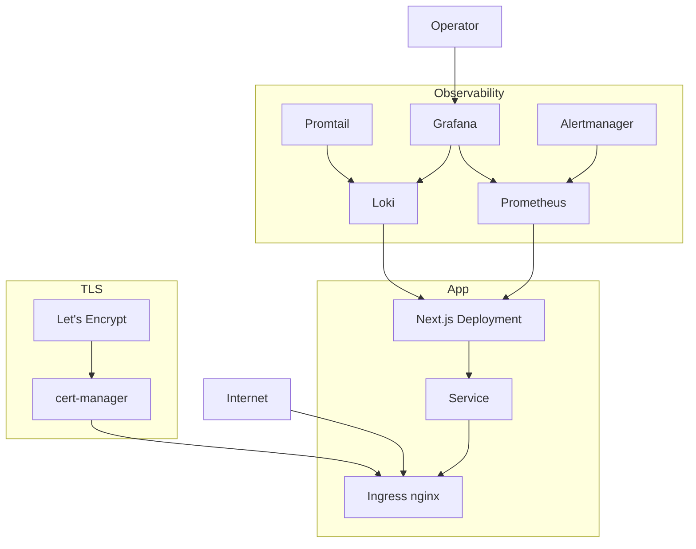

# Architecture

The k8s-ops-toolkit is a Helm chart for Next.js apps plus an opinionated
observability stack. Drop the chart on any Kubernetes cluster, run the
install script, and you have ingress, TLS, metrics, logs, and alerts
without writing yaml.

## Layers



## Helm chart structure

```
charts/nextjs-app/
├── Chart.yaml
├── values.yaml          # all the knobs in one place
└── templates/
    ├── deployment.yaml
    ├── service.yaml
    ├── ingress.yaml     # cert-manager annotations
    ├── hpa.yaml         # CPU/memory autoscaler
    ├── pdb.yaml         # pod disruption budget
    ├── servicemonitor.yaml  # for Prometheus
    └── _helpers.tpl
```

Every template is short. There is no umbrella chart, no library chart.
You can read the whole thing in twenty minutes.

## Observability stack

The `scripts/install.sh` script bootstraps:

- **ingress-nginx** as the cluster ingress (LoadBalancer service)
- **cert-manager** with a ClusterIssuer pointing at Let's Encrypt
- **kube-prometheus-stack** (Prometheus + Grafana + Alertmanager + node exporters)
- **Loki + Promtail** for logs
- A handful of pre-baked Grafana dashboards (cluster, ingress, app)
- Default Alertmanager rules: pod restart loop, ingress 5xx spike, certificate near expiry, disk pressure

This is everything most Next.js production deployments actually need
and nothing more.

## What is intentionally not here

- A service mesh (Istio/Linkerd). For most Next.js apps, mesh complexity outweighs benefit.
- Tempo/Jaeger for distributed tracing. Add if you need it; the pattern is straightforward.
- A custom operator. The chart is plain Helm.
- Multi-tenant tooling. This is single-tenant by design.

## Where to extend

- `values.yaml` exposes resource limits, replicas, env vars, secrets, custom annotations.
- The Grafana dashboards are JSON in `manifests/grafana-dashboards/`. Edit, kubectl apply.
- Alertmanager rules live in `manifests/prometheus-rules/`. Add your own and apply.

## Sister repos

- [terraform-stack](https://github.com/sarmakska/terraform-stack) provisions the cluster + DNS + R2/KV.
- [agent-orchestrator](https://github.com/sarmakska/agent-orchestrator) uses this chart in its example deploys.
