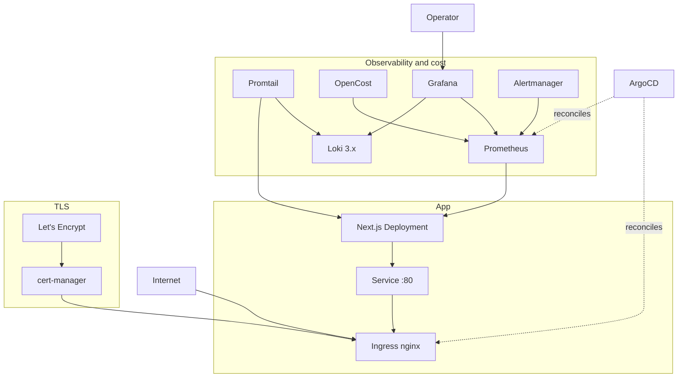

# Architecture

The k8s-ops-toolkit is a Helm chart for Next.js apps plus an opinionated,
version-pinned observability and cost stack. Drop the chart on any Kubernetes
cluster, run the install script or sync the ArgoCD app-of-apps, and you have
ingress, TLS, metrics, logs, alerts, and spend tracking without writing yaml.

## Layers


```mermaid
flowchart TB
  subgraph App
    A[Next.js Deployment] --> S[Service :80]
    S --> I[Ingress nginx]
  end
  subgraph TLS
    CM[cert-manager] --> I
    LE[Let's Encrypt] --> CM
  end
  subgraph Obs[Observability and cost]
    P[Prometheus] --> A
    PT[Promtail] --> L[Loki 3.x]
    PT --> A
    OC[OpenCost] --> P
    G[Grafana] --> P
    G --> L
    AM[Alertmanager] --> P
  end
  Internet --> I
  Ops[Operator] --> G
  Argo[ArgoCD] -.reconciles.-> I
  Argo -.reconciles.-> P
```

## Helm chart structure

```
charts/nextjs-app/
  Chart.yaml
  values.yaml              # all the knobs in one place
  templates/
    _helpers.tpl           # shared label and selector helpers
    deployment.yaml        # rolling update, security context, env injection
    service.yaml           # ClusterIP :80 -> container :3000
    ingress.yaml           # cert-manager annotations, host routing
    hpa.yaml               # CPU autoscaler, gated
    pdb.yaml               # pod disruption budget, gated
    servicemonitor.yaml    # Prometheus scrape, gated
```

Every template is short. There is no umbrella chart and no library chart. You
can read the whole thing in twenty minutes. Labels and selectors come from
`_helpers.tpl` so the selector stays stable across upgrades while the full
label set carries chart and managed-by metadata.

## Platform components

Both `scripts/install.sh` and the ArgoCD app-of-apps under `gitops/argocd`
install the same components at the same pinned versions:

- ingress-nginx 4.12.1 as the cluster ingress (LoadBalancer service).
- cert-manager v1.17.1 with a `letsencrypt-prod` ClusterIssuer.
- kube-prometheus-stack 70.4.2 (Prometheus, Grafana, Alertmanager, node exporters, kube-state-metrics).
- Loki 6.29.0 chart (Loki 3.x) in single-binary mode, with Promtail 6.16.6 shipping container stdout.
- OpenCost 2.1.3 reading allocation data from the in-cluster Prometheus and writing cost metrics back.

Pinning lives in one place in `install.sh` and is mirrored by the GitOps
Applications. The test suite asserts the two stay in step.

## What is intentionally not here

- A service mesh (Istio, Linkerd). For most Next.js apps, mesh complexity outweighs benefit.
- Tempo or Jaeger for distributed tracing. Add it if you need it; the pattern is straightforward.
- A custom operator. The chart is plain Helm.
- Multi-tenant tooling. This is single-tenant by design.

## Where to extend

- `values.yaml` exposes replicas, resource limits, env vars, secrets, ingress annotations, security context, and the rolling update strategy.
- Grafana dashboards are JSON in `manifests/grafana-dashboards/`. Add one and run `scripts/load-dashboards.sh`, or let the GitOps sidecar import it.
- Alertmanager rules live in `manifests/prometheus-rules/`. Add your own and `kubectl apply`.

## Sister repos

- [terraform-stack](https://github.com/sarmakska/terraform-stack) provisions the cluster, DNS, and storage.
- [agent-orchestrator](https://github.com/sarmakska/agent-orchestrator) uses this chart in its example deploys.
